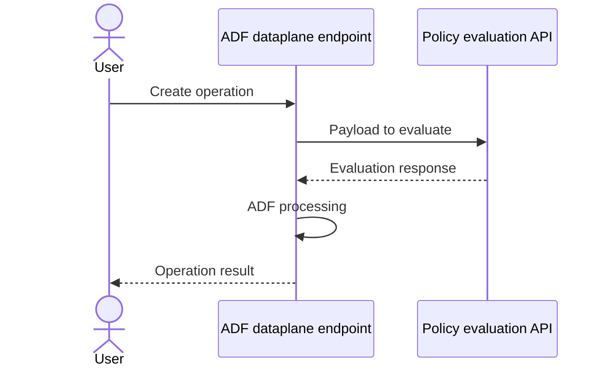

# Azure Data Factory — Policy RP Integration

> **Status**: Public Preview  
> **Scope**: Greenfield only  
> **Supported effects**: Deny  
> **Policy type**: Built-in policies only

## Architecture

When a user performs a create operation on an ADF data plane endpoint, the endpoint calls the Policy evaluation API with the payload. The evaluation API returns a result, ADF continues processing, and returns the operation result to the user.

## Support Ownership

| Team | Ownership | SAP |
|-|-|-|
| ADF | Request to evaluate policy, payload to evaluate | Azure/Data Factory/Security (Permission, Firewall, and etc.)/Policies |
| Policy | Evaluation result, response to evaluation request* | No specific SAP — depends on scenario |

*Policy team also owns everything else under the Policy UX and APIs.

## Additional Information

- [Outbound network rules using Azure Policy (Preview)](https://learn.microsoft.com/en-us/azure/data-factory/configure-outbound-allow-list-azure-policy)
