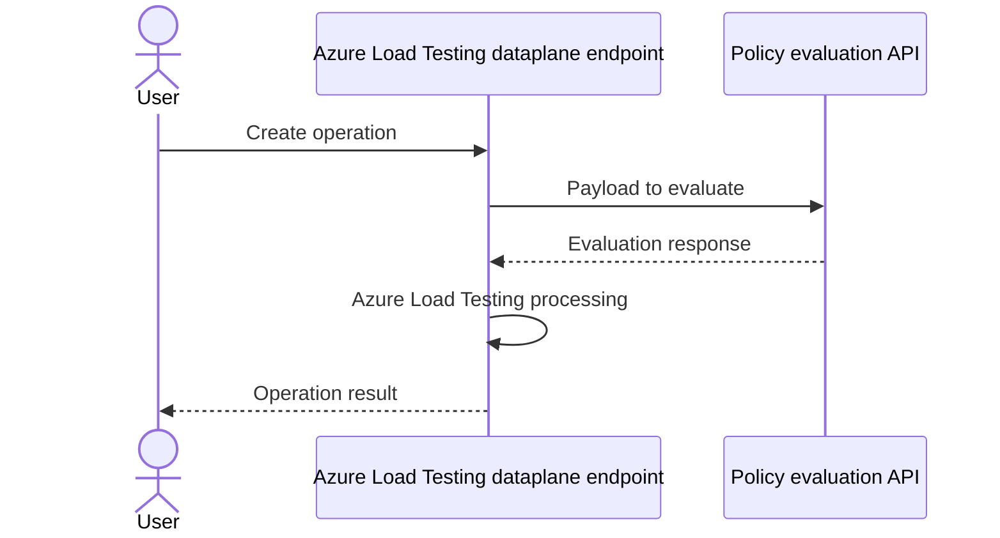

# Azure Load Testing — Policy RP Integration

> **Status**: Public Preview  
> **Supported effects**: Audit, Deny (tbc)  
> **Policy type**: Built-in policies only

## Architecture

When a user performs a create operation on an Azure Load Testing data plane endpoint, the endpoint calls the Policy evaluation API. The evaluation API returns a result, ALT processes accordingly, and returns the operation result to the user.

## Support Ownership

| Team | Ownership | SAP |
|-|-|-|
| ALT | Request to evaluate policy, payload to evaluate | Azure\Azure Load Testing\Test Execution\Provisioning stalls or fails |
| Policy | Evaluation result, response to evaluation request* | No specific SAP — depends on scenario |

*Policy team also owns everything else under the Policy UX and APIs.

## Additional Information

- Additional documentation: tbd (per original wiki page)
