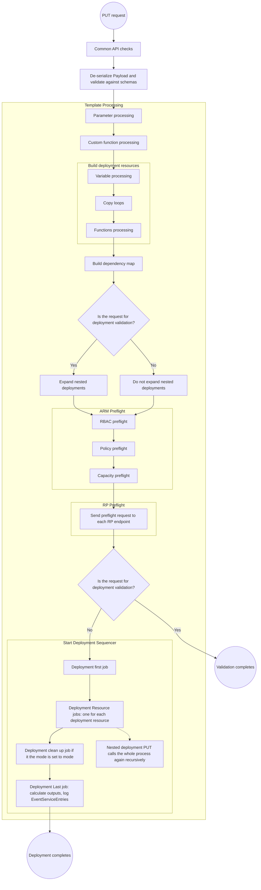

## ARM Template Processing Flow

### Processing Stages

1. **Common API checks** - Initial validation of the request
2. **De-serialize & validate against schemas** - Payload validation
3. **Template Processing** - Parameter → Custom function → Variable processing
4. **Build deployment resources** - Copy loops → Functions processing
5. **Build dependency map** - Determine execution order
6. **Preflight** - ARM preflight (RBAC → Policy → Capacity) → RP preflight
7. **Deployment Sequencer** - First job → Resource jobs → Cleanup → Last job

### Key Points
- Validation-only requests expand nested deployments but stop after preflight
- Full deployments proceed through the sequencer after preflight
- Nested deployments recursively invoke the entire processing pipeline
- Deployment cleanup job runs if deployment mode is set to "Complete"
