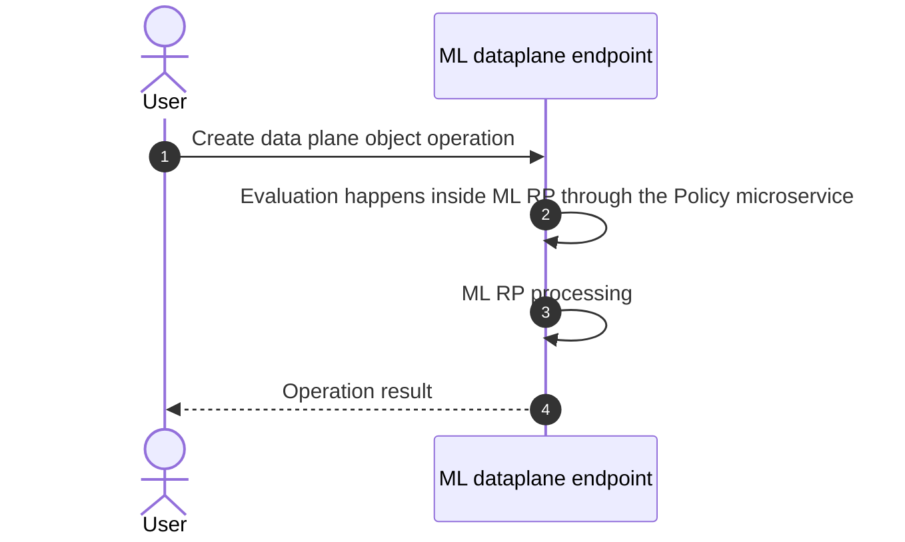
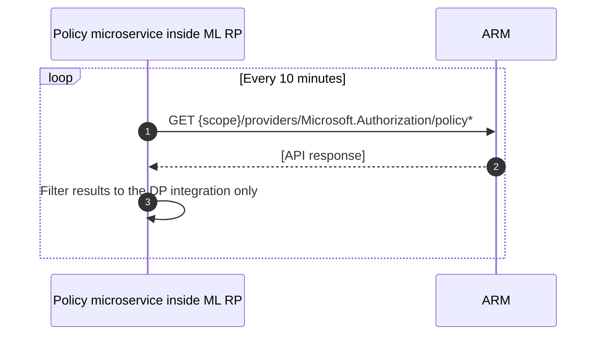

> Public Preview

> Greenfield only

> Supported effects: Deny

> Built-in policies only

## Architecture

### Greenfield

> Policy RP is **not** involved during this evaluation process.

### Policy retrieval process

The diagram below covers how the Partner integration updates the policies cache for evaluation inside the RP.

> `policy*` refers to any policy resource (definitions, assignments, initiatives, exemptions, etc.)

## Support ownership

| Team | Ownership | SAP |
|-|-|-|
| Machine Learning | Payload to evaluate, Policy micro-service, evaluation result | Azure/Machine Learning/Workspace Management, Configuration and Security/Issues with Azure ML built-in policies |
| Policy | All policy APIs, anything related to the Policy clients or UI | No specific SAP, depends on the scenario |

> From ML side, the above support scope was approved. If there is any pushback on support scope from ML team, please pull Cameron into the conversation.

## Additional information

- Resource provider TSG: [[ADO] Feature: Azure ML Policy for Registries](https://dev.azure.com/supportability/AzureML/_wiki/wikis/AzureML/1216054/Feature-Azure-ML-Policy-for-Registries?anchor=tsg-with-kusto-and-errors)
