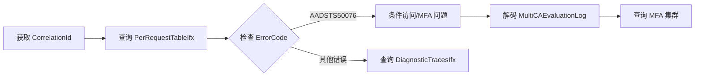
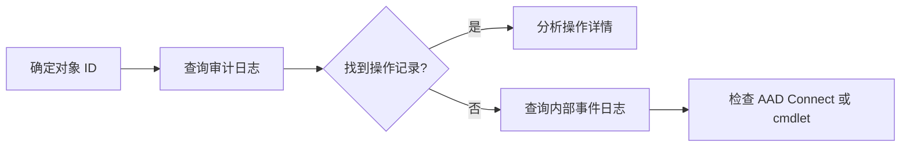

# Entra ID Kusto 查询 Skill

## 概述

本 Skill 用于查询 Entra ID (Azure AD) 相关的 Kusto 日志，诊断登录、条件访问、MFA、目录同步、授权等问题。

## 触发关键词

- 登录、Sign-in、Authentication
- 条件访问、Conditional Access、CA
- MFA、多因素认证
- AAD、Azure AD、Entra ID
- PRT、Primary Refresh Token
- AAD Connect、目录同步
- 审计、Audit
- 网关节流、Throttle

## 集群信息

| 服务 | URI | 数据库 | 用途 |
|------|-----|--------|------|
| ESTS | https://estscnn2.chinanorth2.kusto.chinacloudapi.cn | ESTS | 登录服务 |
| MSODS | https://msodsmooncake.chinanorth2.kusto.chinacloudapi.cn | MSODS | 目录服务 |
| MFA BJB | https://idsharedmcbjb.chinanorth2.kusto.chinacloudapi.cn | idmfacne | MFA 服务 (北京) |
| MFA SHA | https://idsharedmcsha.chinaeast2.kusto.chinacloudapi.cn | idmfacne | MFA 服务 (上海) |
| CPIM | https://cpimmcprod2.chinanorth2.kusto.chinacloudapi.cn | CPIM | B2C 服务 |
| Gateway BJB | https://idsharedmcbjb.chinanorth2.kusto.chinacloudapi.cn | AADGatewayProd | AAD Gateway (北京) |
| Gateway SHA | https://idsharedmcsha.chinaeast2.kusto.chinacloudapi.cn | AADGatewayProd | AAD Gateway (上海) |

详细集群信息见: [kusto_clusters.csv](./references/kusto_clusters.csv)

## 主要表

### ESTS 数据库 (登录服务)

| 表名 | 用途 | 文档 |
|------|------|------|
| PerRequestTableIfx | 认证请求详情 | [查看](./references/tables/PerRequestTableIfx.md) |
| DiagnosticTracesIfx | 诊断跟踪日志 | [查看](./references/tables/DiagnosticTracesIfx.md) |
| UserErrorsIfx | 用户错误日志 | (联合查询 DiagnosticTracesIfx) |

### MSODS 数据库 (目录服务)

| 表名 | 用途 | 文档 |
|------|------|------|
| IfxAuditLoggingCommon | 目录对象审计 | [查看](./references/tables/IfxAuditLoggingCommon.md) |
| IfxUlsEvents | 内部操作事件 | [查看](./references/tables/IfxUlsEvents.md) |
| IfxBECAuthorizationManager | 授权管理日志 | [查看](./references/tables/IfxBECAuthorizationManager.md) |

### MFA 数据库 (多因素认证)

| 表名 | 用途 | 文档 |
|------|------|------|
| SASCommonEvent | MFA 通用事件 | [查看](./references/tables/SASCommonEvent.md) |
| SASRequestEvent | MFA 请求事件 | [查看](./references/tables/SASRequestEvent.md) |
| CappWebSvcRequest | 外部提供商通信 | [查看](./references/tables/CappWebSvcRequest.md) |

### AAD Gateway 数据库

| 表名 | 用途 | 文档 |
|------|------|------|
| RequestSummaryEventCore | 网关请求摘要 | [查看](./references/tables/RequestSummaryEventCore.md) |

## 预定义查询

| 查询 | 用途 | 集群 |
|------|------|------|
| [signin-logs.md](./references/queries/signin-logs.md) | 登录日志查询 | ESTS |
| [conditional-access-decode.md](./references/queries/conditional-access-decode.md) | 条件访问策略解码 | ESTS |
| [diagnostic-traces.md](./references/queries/diagnostic-traces.md) | 诊断跟踪查询 | ESTS |
| [mfa-detail.md](./references/queries/mfa-detail.md) | MFA 详细日志 | MFA |
| [audit-logs.md](./references/queries/audit-logs.md) | 目录审计日志 | MSODS |
| [aad-connect-sync.md](./references/queries/aad-connect-sync.md) | AAD Connect 同步 | MSODS |
| [authorization-manager.md](./references/queries/authorization-manager.md) | 授权管理查询 | MSODS |
| [gateway-throttle.md](./references/queries/gateway-throttle.md) | 网关节流检测 | Gateway |

## 诊断工作流程

### 流程 1: 登录失败排查

**步骤:**
1. 使用 [signin-logs.md](./references/queries/signin-logs.md) 查询登录请求
2. 检查 ErrorCode 确定错误类型
3. 使用 [conditional-access-decode.md](./references/queries/conditional-access-decode.md) 解码条件访问策略
4. 如涉及 MFA，使用 [mfa-detail.md](./references/queries/mfa-detail.md) 查询详细日志

### 流程 2: 目录对象操作审计

**步骤:**
1. 使用 [audit-logs.md](./references/queries/audit-logs.md) 查询审计日志
2. 如需 AAD Connect 同步详情，使用 [aad-connect-sync.md](./references/queries/aad-connect-sync.md)

### 流程 3: MFA 问题诊断

**步骤:**
1. 从 ESTS 获取 CorrelationId (即 MFA 的 TrackingID)
2. 使用 [mfa-detail.md](./references/queries/mfa-detail.md) 查询 SASCommonEvent
3. 检查 AuthenticationMethod 和 Msg 字段
4. 如需查看外部提供商通信，查询 CappWebSvcRequest

## 常见诊断场景

### 场景 1: 登录被阻止
1. 查询 PerRequestTableIfx 获取 ErrorCode
2. 检查 MultiCAEvaluationLog 了解条件访问评估
3. 使用 conditional-access-decode.md 解码策略

### 场景 2: MFA 提示异常
1. 查询 PerRequestTableIfx 检查 MfaStatus
2. 检查 SourcesOfMfaRequirement 了解 MFA 要求来源
3. 查询 MFA 集群获取详细日志

### 场景 3: 设备合规问题
1. 查询 PerRequestTableIfx 检查 IsDeviceCompliantAndManaged
2. 检查 DeviceTrustType 了解设备信任类型

### 场景 4: AAD Connect 同步问题
1. 使用 aad-connect-sync.md 统计同步事件
2. 过滤 env_cloud_role = "msods-syncservice" 查看同步详情
3. 检查 message 字段查找异常

### 场景 5: 网关节流检测
1. 使用 gateway-throttle.md 查询 AdditionalParameters 包含 ThrottleEnforcement
2. 检查 IsThrottled 字段

### 场景 6: 权限被拒绝
1. 使用 authorization-manager.md 查询 result = "DENIED"
2. 检查 scopeClaim 了解权限范围

## 关键字段说明

### ESTS 字段

| 字段 | 说明 |
|------|------|
| CorrelationId | 请求关联 ID（跨表追踪的关键） |
| ErrorCode | 错误码（如 AADSTS50076） |
| Result | 认证结果 (Success/Failure) |
| MultiCAEvaluationLog | 条件访问评估日志（原始格式） |
| IsDeviceCompliantAndManaged | 设备合规状态 |
| DeviceTrustType | 设备信任类型 |
| MfaStatus | MFA 状态 |
| ITData | 输入数据（如 refresh token） |
| OTData | 输出数据（如 access token） |

### MFA 字段

| 字段 | 说明 |
|------|------|
| TrackingID | 追踪 ID（等于 ESTS CorrelationId） |
| AuthenticationMethod | 认证方法 |
| Msg | 事件消息 |
| SasSessionId | MFA 会话 ID |

### MSODS 字段

| 字段 | 说明 |
|------|------|
| env_cloud_role | 云角色（标识操作来源） |
| operationName | 操作名称 |
| targetObjectId | 目标对象 ID |
| actorObjectId | 执行者对象 ID |

## 云角色映射 (env_cloud_role)

| 角色值 | 操作来源 | 说明 |
|--------|---------|------|
| becwebservice | MSOL cmdlets, O365 Portal | MSOnline 模块操作 |
| restdirectoryservice | AAD cmdlets, Graph API | Graph API 调用 |
| adminwebservice | AAD Connect | 同步服务配置 |
| msods-syncservice | Directory Sync | 目录同步服务 |

## 时间范围建议

| 场景 | 推荐时间范围 | 原因 |
|------|-------------|------|
| 实时认证问题 | 1-6 小时 | 快速定位问题 |
| MFA 策略分析 | 24 小时 | 覆盖完整活动周期 |
| 审计日志查询 | 7-30 天 | 合规性审查 |
| AAD Connect 同步 | 1-7 天 | 观察多个同步周期 |

## 参考资源

### 本地文档
- [表定义目录](./references/tables/README.md)
- [查询模板目录](./references/queries/README.md)
- [集群信息](./references/kusto_clusters.csv)

### 外部链接
- [Entra ID Wiki](https://supportability.visualstudio.com/AzureAD/_wiki/wikis/AzureAD/567300/Welcome)
- [Identity Wiki](https://dev.azure.com/IdentityDivision/IdentityWiki/_wiki/wikis/IdentityWiki.wiki/1162/IdentityWiki)
- [Azure AD B2C TSG](https://dev.azure.com/Supportability/AzureAD/_wiki/wikis/AzureAD/183941/Azure-AD-B2C)
- [MFA Kusto 示例](https://identitydivision.visualstudio.com/IdentityWiki/_wiki/wikis/IdentityWiki.wiki/5611/MFA-Kusto)

---

> 文档版本: 2.0  
> 最后更新: 2026-01-14  
> 数据来源: Mooncake Entra ID Kusto 集群 schema 验证
